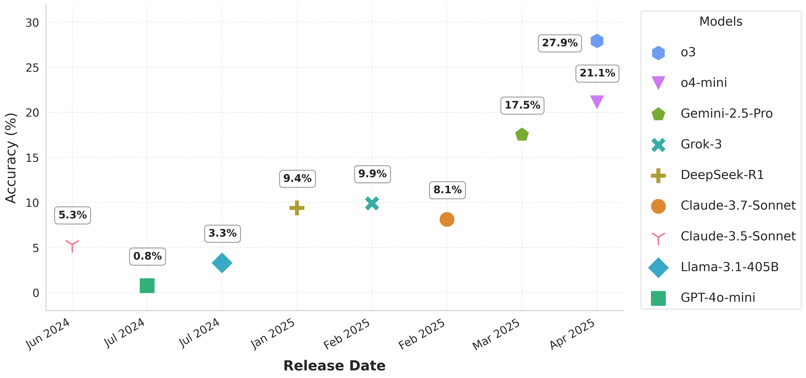
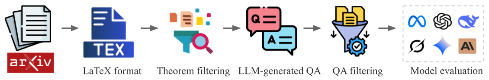

# RealMath Benchmark

A novel benchmark derived directly from research papers and mathematical forums that assesses LLMs' abilities on authentic mathematical tasks.



## Motivation

In this work, we present **RealMath**:

- A data pipeline that extracts verifiable mathematical statements from research papers (e.g., arXiv) and mathematical forums (e.g., Stack Exchange), creating a rich corpus of research-level mathematical content.

- An evaluation methodology focused on verifiable answers rather than proof assessment, allowing for automated correctness checking.

- A continually refreshable dataset design, that leverages the vast and growing body of mathematical literature, allowing for regular updates with new content to mitigate contamination concerns.


## Overview

This project implements an end-to-end pipeline that:
1. Retrieves papers related to mathematical problems from arXiv, e.g., CS, Math, etc.
2. Extracts and processes LaTeX source code
3. Extracts theorems from these papers
4. Generates question-answer pairs from theorems with fixed answers
5. Evaluate the capabilities of LLMs on solving the question-answer pairs




## Requirements

- Python 3.12
- Dependencies:
  ```bash
  pip install -r requirements.txt
  ```

- As this repo doesn't require any GPU, it's easy to run the server locally. But make sure you have a    <span style="color:red">latex installation</span>  on your machine, because we ensure the QA pairs in latex format can be directly rendered when we mannually check the theorems.

## Quick Start

An example:

```bash
#!/bin/bash
OUTPUT_PATH=MATH_2025_5

# 1. Retrieve math papers
python helpers/arxiv_retriever.py --year 2025 --month 5 --output $OUTPUT_PATH/papers --max-results 5000 --category math

# 2. Extract LaTeX source
python helpers/extract_latex_text.py --input $OUTPUT_PATH/papers --output $OUTPUT_PATH/latex

# 3. Extract theorems
python helpers/extract_theorems.py --input $OUTPUT_PATH/latex --output $OUTPUT_PATH/theorems 

# 4. Generate QA pairs
python helpers/extract_qa.py --input $OUTPUT_PATH/theorems_filtered --output $OUTPUT_PATH/qa_pairs 

# 5. Evaluate the QA pairs
python eval_math.py --model o3 --output $OUTPUT_PATH/results  --verbose --dataset $OUTPUT_PATH/qa_pairs_filtered


# Wait for both parallel processes to complete
wait

echo "Done!"
```


